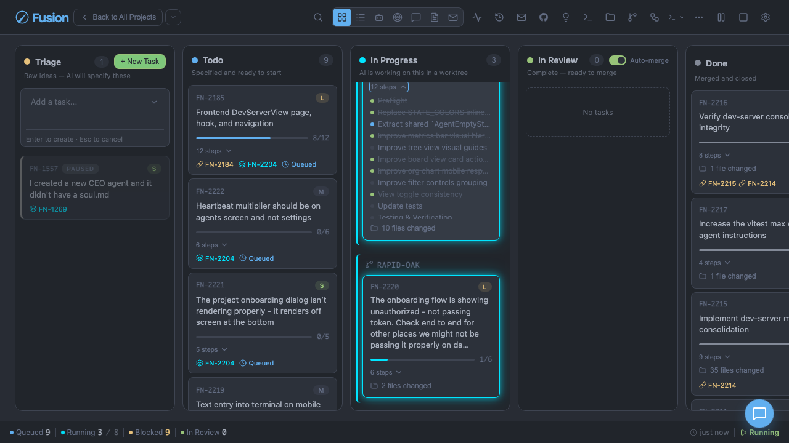
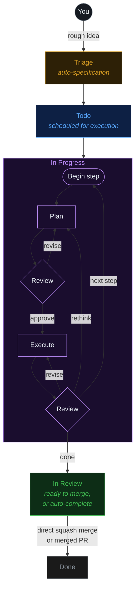

# Fusion

AI-orchestrated task board. Like Trello, but your tasks get specified, executed, and delivered by AI — powered by [pi](https://github.com/badlogic/pi-mono).



## Workflow



Tasks with dependencies are processed sequentially. Independent tasks run in parallel.

## Missions

The Missions system provides a hierarchical planning structure for large-scale projects:

```
Mission ("Build Auth System")
├── Milestone 1: "Database Schema"
│   ├── Slice 1: "User Tables"
│   │   ├── Feature 1: "User model" → Task FN-101
│   │   └── Feature 2: "Session table" → Task FN-102
│   └── Slice 2: "Token Storage"
│       └── Feature 3: "Refresh tokens" → Task FN-103
├── Milestone 2: "API Endpoints"
│   └── Slice 3: "Login/Logout"
│       ├── Feature 4: "Login endpoint" → Task FN-104
│       └── Feature 5: "Logout endpoint" → Task FN-105
└── Milestone 3: "UI Integration"
    └── Slice 4: "React Components"
        └── Feature 6: "Login form" → Task FN-106
```

**Hierarchy:** Mission → Milestone → Slice → Feature → Task

- **Mission** — High-level goal or project (e.g., "Build Authentication System")
- **Milestone** — Major phases within a mission (e.g., "Database Schema", "API Endpoints")
- **Slice** — Parallel work areas within a milestone (e.g., "Backend Implementation", "Frontend Components")
- **Feature** — Individual deliverables linked to kb tasks (e.g., "Login Form", "JWT Middleware")

Status flows automatically: when features are linked to tasks and completed, slice status updates. Linked tasks persist both `missionId` and `sliceId` so mission progress can be observed through normal task reads. When all slices in a milestone are complete, the milestone becomes complete. When all milestones are done, the mission is complete.

**CLI Commands:**
```bash
fn mission create "Build Auth System" "Complete auth with login, signup"  # Create mission
fn mission list                                                           # List all missions
fn mission show M-LZ7DN0-A2B5                                             # Show mission hierarchy
fn mission delete M-LZ7DN0-A2B5 [--force]                                # Delete mission
fn mission activate-slice SL-P4T2WX-D5E8                                  # Manually activate slice
```

**Dashboard:** Click the Target icon in the dashboard header to open the Mission Manager, then create missions, add milestones, slices, and features. Link features to tasks for automatic progress tracking. On mobile devices, the Mission Manager opens as a full-screen overlay with touch-friendly controls and stacked hierarchy cards.

## Quick Start

```bash
npm i -g @gsxdsm/fusion
```

Then from the root of your repository:

```bash
fn dashboard
```

Or start with interactive port selection:

```bash
fn dashboard --interactive
```

Open [http://localhost:4040](http://localhost:4040) — create tasks from the board or the CLI.

### CLI commands

**Dashboard:**
```bash
fn dashboard                              # Start the web UI (default port 4040)
fn dashboard --interactive                # Start with interactive port selection
fn dashboard --paused                     # Start with automation paused
fn dashboard --dev                        # Start web UI only (no AI engine)
```

**Mission Management:**
```bash
fn mission create "Title" "Description"    # Create a new mission
fn mission list                             # List all missions
fn mission show <id>                        # Show mission with hierarchy
fn mission delete <id> [--force]            # Delete mission (cascades to children)
fn mission activate-slice <slice-id>        # Manually activate a pending slice
```

**Task Management:**
```bash
fn task create "Fix the login bug"         # Create a new task (goes to triage)
fn task create "Bug" --attach screenshot.png --depends FN-001
fn task plan "Build auth system"          # Create task via AI-guided planning
fn task list                              # List all tasks
fn task show FN-001                       # Show task details, steps, log
fn task logs FN-001 [--follow] [--limit 50] [--type tool]
fn task move FN-001 todo                   # Move a task to a column
fn task merge FN-001                     # Merge an in-review task
fn task duplicate FN-001                 # Duplicate a task (copy to triage)
fn task refine FN-001 --feedback "Add tests"  # Create refinement task
fn task archive FN-001                   # Archive a done task
fn task unarchive FN-001                 # Restore an archived task
fn task delete FN-001 [--force]          # Delete a task
fn task retry FN-001                     # Retry a failed task
fn task comment FN-001 "Looks good"      # Add a general task comment
fn task comments FN-001                  # List task comments
fn task steer FN-001 "Use TypeScript"    # Add steering comment
fn task pause FN-001                     # Pause automation for task
fn task unpause FN-001                   # Resume automation for task
```

**Refinement tasks** created with `fn task refine` inherit a readable label from the source task. The title follows the format `Refinement: {source label}` where the source label is the original task's title (if set), otherwise the first line of the original description. This keeps refinement task names meaningful even when the source task has no explicit title.

**GitHub Integration:**
```bash
fn task import owner/repo                  # Import all open issues
fn task import owner/repo --interactive    # Interactive issue selection
fn task import owner/repo --limit 10       # Limit number of issues
fn task import owner/repo --labels bug     # Filter by label(s)
fn task pr-create FN-001 --title "Fix" --base main
```

**Git Commands:**
```bash
fn git status                             # Show branch, commit, dirty state
fn git fetch [remote]                     # Fetch from remote
fn git pull [--yes]                       # Pull current branch
fn git push [--yes]                       # Push current branch
```

**Settings:**
```bash
fn settings                               # Show current configuration
fn settings set maxConcurrent 4          # Update a setting
```

**GitHub Import:**
- Batch mode imports all open issues automatically (skipping already-imported)
- Interactive mode (`-i`) lets you select specific issues from a numbered list
- Uses `gh` CLI authentication (run `gh auth login`) or falls back to `GITHUB_TOKEN` for private repositories
- Pull requests are automatically filtered out (use `fn task pr-create` to create PRs from tasks)

**Dashboard Import:**
- Click the ↓ (Download) icon in the header to open the GitHub import modal
- Fusion detects GitHub remotes automatically: a single remote is preselected, and multiple remotes can be chosen from a repository dropdown
- Optionally filter the fetched issues with comma-separated labels before loading open issues
- Review the results list and preview pane, then select the issue you want to import
- Already-imported issues stay visible with an "Imported" badge and cannot be selected again

Agents can use these same commands, or see [`.agents/skills/`](.agents/skills/) for structured skill docs.

### Prerequisites

The AI engine uses [pi](https://github.com/badlogic/pi-mono) under the hood:

1. `npm i -g @mariozechner/pi-coding-agent`
2. Run `pi` and use `/login`, or set `ANTHROPIC_API_KEY`

Fusion reuses your existing pi authentication.

## Packages

| Package         | Description                                                     |
| --------------- | --------------------------------------------------------------- |
| `@fusion/core`  | Domain model — tasks, board columns, file-based store           |
| `@fusion/dashboard` | Web UI — Express server + kanban board with SSE                 |
| `@fusion/engine`    | AI engine — triage (pi), execution (pi + worktrees), scheduling |
| `kb` (cli)      | CLI — `fn dashboard`, `fn task create/list/move/attach`         |

## Architecture

### Task Storage

Tasks live on disk in `.fusion/tasks/` in the project root:

```
.fusion/
├── config.json              # Board config + ID counter
└── tasks/
    └── FN-001/
        ├── task.json        # Metadata (column, deps, timestamps)
        ├── PROMPT.md        # Task specification
        └── attachments/     # File attachments — images & text files (optional)
```

### Board UI

Real-time kanban board at `localhost:4040`:

- Drag-and-drop cards between columns
- Create tasks from the web UI
- Click cards for detail view with move/delete actions
- Server-Sent Events for live updates across tabs
- Fixed executor status bar at the bottom of the viewport stays clear of scrollable board, list, and agents content on both desktop and mobile

### AI Engine

The AI engine starts automatically with the dashboard. Three components run:

- **TriageProcessor** — Watches triage column. Spawns a pi agent session that reads the project, understands context, and writes a full PROMPT.md specification. Moves task to todo.

- **Scheduler** — Watches todo column. Resolves dependency graphs. Moves tasks to in-progress when deps are satisfied and concurrency allows (default: 2 concurrent). When `groupOverlappingFiles` is enabled in settings, tasks whose `## File Scope` sections share files are serialized to prevent merge conflicts.

- **TaskExecutor** — Listens for tasks entering in-progress. Creates a git worktree, spawns a pi agent session with full coding tools scoped to the worktree, and executes the specification. If the task has enabled workflow steps, runs them sequentially before moving to in-review.

Each pi agent session gets:

- Custom system prompt for its role (triage specifier vs task executor)
- Tools scoped to the correct directory (`createCodingTools(cwd)`)
- In-memory sessions (no persistence needed)
- Auto-compaction enabled to automatically summarize conversation history when context fills up, preventing context-window overflow in long-running agent conversations
- The user's existing pi auth (API keys from `~/.pi/agent/auth.json`)

### Error Recovery

The engine automatically recovers from transient infrastructure failures (network blips, proxy errors, connection resets) using bounded exponential backoff:

- **Recoverable failures** — When a transient error is detected during task execution or triage specification, the task is requeued with an increasing backoff delay (60s → 120s → 240s, capped at 5 minutes). Up to 3 retry attempts are made before the task is marked as permanently failed.
- **Recovery metadata** — Each task stores `recoveryRetryCount` and `nextRecoveryAt` (ISO-8601 timestamp) in SQLite. The scheduler and triage processor skip tasks whose `nextRecoveryAt` is still in the future, ensuring backoff is respected across engine restarts.
- **Budget exhaustion** — After 3 failed recovery attempts, executor tasks are marked as `failed` and triage tasks receive an error message for manual intervention. Recovery metadata is cleared.
- **Separate from other retry mechanisms** — Recovery retries are distinct from `mergeRetries` (merge-conflict resolution), `withRateLimitRetry` (in-session rate-limit backoff), and usage-limit global pauses. User pauses, stuck-task-detector kills, and dependency-abort cleanups do not consume the recovery budget.

## Model System

Fusion provides flexible AI model configuration with support for model presets, per-task overrides, and a hierarchical settings system.

### Model Presets

Model presets let teams standardize AI model choices. Each preset contains:
- **ID** — stable slug for storage (e.g., `budget`, `normal`, `complex`)
- **Name** — human-friendly label
- **Executor model** — provider/model pair for task execution
- **Validator model** — provider/model pair for code/spec review

Presets can be auto-selected by task size:
- **Small (S)** → Budget preset
- **Medium (M)** → Normal preset  
- **Large (L)** → Complex preset

### Per-Task Model Overrides

Override global models for specific tasks:
- **Executor Model** — AI model that implements the task
- **Validator Model** — AI model that reviews code and plans

Set overrides in the dashboard via **task detail → Model tab**, or choose **Custom** during task creation.

### Settings Hierarchy

**Global settings** (`~/.pi/fusion/settings.json`):
- `defaultProvider` / `defaultModelId` — Default AI models
- `planningProvider` / `planningModelId` — Task specification models
- `validatorProvider` / `validatorModelId` — Review models
- `themeMode`, `colorTheme` — UI preferences
- `ntfyEnabled`, `ntfyTopic` — Push notifications

**Project settings** (`.fusion/config.json`):
- `modelPresets` — Custom preset definitions
- `autoSelectPresetBySize` — Size-to-preset mappings
- All workflow and automation settings

Project settings override global settings. Configure in the dashboard under **Settings > Model**.

## Task Planning & Creation

Fusion offers multiple ways to create tasks, from quick entry to AI-assisted planning.

### Planning Mode

Use AI-guided planning for complex tasks. The AI interviews you to refine requirements before creating the task:

```bash
fn task plan "Build a user authentication system"
```

Or in the dashboard, type a description and click the **Plan** button (💡) to open the planning modal.

### Subtask Breakdown

Break large tasks into smaller, manageable subtasks before creation:

1. Type a task description in the dashboard
2. Click the **Subtask** button (🌳) to open the breakdown dialog
3. AI suggests 2-5 subtasks based on your description
4. Edit titles, descriptions, sizes, and dependencies
5. Drag-and-drop to reorder subtasks (affects execution order)
6. Create all subtasks in one action with proper dependency links

### AI Text Refinement

When creating tasks, the AI can refine your description:
- Converts rough ideas into structured task specifications
- Suggests appropriate file scopes and steps
- Available in both Quick Entry and planning mode

### Manual Plan Approval

Enable `requirePlanApproval` in settings for manual review of AI-generated specifications:

```json
{
  "settings": {
    "requirePlanApproval": true
  }
}
```

When enabled, tasks stay in **Triage** with "awaiting-approval" status after AI specification. On the board, these tasks are highlighted with an amber left border and a gentle pulsing background, plus an **Awaiting Approval** status tag — making them easy to spot among other triage items. Review the PROMPT.md in the task detail modal, then click **Approve Plan** to move to **Todo** or **Reject Plan** to regenerate.

## Development

```bash
pnpm install
pnpm dev dashboard              # Board + AI engine
pnpm dev task list              # CLI commands
```

### Type Checking

The workspace supports clean-checkout type checking — no build artifacts required:

```bash
pnpm typecheck                  # Type-check all packages
```

This command validates TypeScript across all packages using source file resolution, without requiring `dist/` output from prior builds. Run it after cloning or before committing to catch type errors early.

## Dashboard Features

### Interactive Terminal

A fully interactive PTY-based terminal is available in the dashboard for executing shell commands directly from the web interface:

- Real PTY using node-pty with authentic bash/zsh/powershell behavior
- xterm.js for full terminal emulation with colors and ANSI support
- WebSocket bidirectional communication for instant input/output
- Auto-resizing with zoom support (Ctrl++/-)
- Copy/paste via keyboard shortcuts
- Mobile virtual-keyboard-aware positioning — the terminal automatically adjusts its layout when a mobile virtual keyboard opens, keeping the command entry area visible

### Git Manager

Built-in Git repository visualization and management:

- View commits with diffs
- Manage branches
- See worktree/task associations
- Perform fetch/pull/push operations
- View pending-push commits and inspect recent commit history per remote

### Activity Log

Global activity tracking accessible from the header (history icon):

- Task lifecycle events: created, moved, merged, failed, deleted
- Settings changes for important configuration updates
- Filter events by type
- Auto-refresh every 30 seconds

### Files

Built-in file browser for viewing and editing project files directly from the dashboard:

- Browse the project root or any active task worktree
- View and edit text files with syntax highlighting
- Hidden files and directories (dotfiles like `.env.example`, `.github/*`) are visible
- Create and save files within the workspace

### Board Search & Views

**Board View:**
- Real-time search across task IDs, titles, and descriptions
- Search bypasses per-column pagination so all matching tasks are visible
- Drag-and-drop between columns
- Column visibility toggle (show/hide columns)

**List View:**
- Group by column, size, or none
- Inline editing of task titles
- Duplicate task button for quick cloning

### Theme System

- **Theme modes:** Dark, Light, System (follows OS preference)
- **17 color themes:** Default, Ocean, Forest, Sunset, Zen, Berry, Monochrome, High Contrast, Industrial, Solarized, Factory, Ayu, One Dark, Nord, Dracula, Gruvbox, Tokyo Night
- Quick toggle in header, full selector in Settings > Appearance
- Preferences persist to localStorage

## Archive

Completed tasks can be archived to keep the board focused on recent work while preserving historical tasks.

**CLI:**
```bash
fn task archive FN-001        # Archive a done task
fn task unarchive FN-001      # Restore an archived task to done
```

**Dashboard:**
- New "Archived" column at the end of the board (collapsed by default)
- Archive/unarchive buttons on task cards (visible on hover)
- Archived tasks cannot be dragged or modified

Archive cleanup removes task directories while preserving metadata in `.fusion/archive.jsonl`. Restored tasks keep all metadata but lose attachments and agent logs.

## Building a standalone executable

You can build a single self-contained `fn` binary using [Bun](https://bun.sh/):

```bash
pnpm build:exe
```

This compiles all TypeScript, builds the dashboard client, and produces:

- `packages/cli/dist/fn` — the standalone binary
- `packages/cli/dist/client/` — co-located dashboard assets

Run the binary directly — no Node.js, pnpm, or workspace setup needed:

```bash
./packages/cli/dist/fn --help
./packages/cli/dist/fn task list
./packages/cli/dist/fn dashboard
```

To distribute, copy both the `fn` binary and the `client/` directory together.

### Cross-compilation

Build binaries for all supported platforms from a single machine:

```bash
pnpm build:exe:all
```

This produces binaries for all supported targets in `packages/cli/dist/`:

| Target             | Output               |
| ------------------ | -------------------- |
| `bun-linux-x64`    | `fusion-linux-x64`       |
| `bun-linux-arm64`  | `fusion-linux-arm64`     |
| `bun-darwin-x64`   | `fusion-darwin-x64`      |
| `bun-darwin-arm64` | `fusion-darwin-arm64`    |
| `bun-windows-x64`  | `fusion-windows-x64.exe` |

To build for a specific platform:

```bash
pnpm --filter kb build:exe -- --target bun-linux-x64
```

The `client/` directory is shared across all binaries (platform-independent assets).

You can override the dashboard asset path via the `FUSION_CLIENT_DIR` environment variable:

```bash
FUSION_CLIENT_DIR=/path/to/client ./fn dashboard
```

**Prerequisites:** Bun ≥ 1.0 (`bun --version`)

## GitHub Integration

Fusion uses the `gh` CLI (GitHub CLI) for all GitHub operations. If you have `gh` installed and authenticated (run `gh auth login`), Fusion will use your existing session. For environments without `gh` CLI, you can set `GITHUB_TOKEN` as a fallback.

### Real-Time PR/Issue Badges

Tasks with linked GitHub PRs or imported issues display real-time status badges on the board:

- **PR badges** — Shows open/closed/merged state with check status
- **Issue badges** — Shows open/closed state
- **WebSocket updates** — Badge status updates instantly via WebSocket when changes occur on GitHub
- **Multi-instance support** — Redis pub/sub enables badge updates across load-balanced dashboard instances (configure via `FUSION_BADGE_PUBSUB_REDIS_URL`)

### PR Creation

Create GitHub Pull Requests from the CLI or dashboard:

**CLI:**
```bash
fn task pr-create FN-001 --title "Fix login bug" --base main --body "Detailed description"
```

**Dashboard:**
1. Ensure you have `gh` CLI installed and authenticated (`gh auth login`), or set the `GITHUB_TOKEN` environment variable
2. Open a task in the **In Review** column
3. Click **"Create PR"** in the Pull Request section
4. Enter a title and optional description
5. The PR is created and linked to the task automatically

The dashboard shows real-time PR status (open, closed, merged) with a refresh button to fetch the latest state from GitHub.

### Auto-completion modes

Fusion supports two completion strategies once a task reaches **In Review**:

- **Direct merge** *(default)* — existing behavior. Fusion AI-squash-merges the task branch into your current branch locally.
- **Pull request** — Fusion creates or links a GitHub PR for the task branch, keeps the task in **In Review** while reviews/checks are pending, and auto-merges the PR when required checks succeed and no review is actively blocking it.

`autoMerge` still controls whether Fusion performs either completion strategy automatically. Turning `autoMerge` off means tasks stay in **In Review** until you merge manually.

### PR-first mode prerequisites and behavior

PR-first automation is designed for repositories that require GitHub-side governance:

- Authenticate GitHub access with `gh auth login` (the `gh` CLI is required for PR monitoring and badge updates)
- Ensure the task branch already exists on GitHub using the normal fusion branch naming convention: `fusion/<task-id-lower>`
- Expect the task to remain in **In Review** while required checks are pending/failing or a review is blocking merge

**Important:** Fusion does **not** implicitly push task branches before creating a PR. PR-first mode assumes branch publishing is handled by your existing workflow or repository automation.

#### Manual merge (`autoMerge=false`)

When `autoMerge` is off and a task's PR is closed or merged, Fusion checks for unaddressed review feedback that was collected while the PR was open. If actionable comments were left by reviewers, Fusion automatically creates a follow-up task in **Triage** depending on the original task. This ensures PR feedback is never silently dropped even when automatic merging is disabled.

### Spec Editing & AI Revision

The dashboard includes a **Spec** tab for managing task specifications directly in the UI:

**Manual Edit:**
1. Open any task and click the **Spec** tab
2. Click **Edit** to modify the PROMPT.md content directly
3. Save changes with the **Save** button (or Ctrl/Cmd+Enter)

**Request AI Revision:**
1. In the Spec tab, use the **"Ask AI to Revise"** section
2. Enter feedback describing what needs to change (e.g., "Add more details about error handling", "Split this into smaller steps")
3. Click **"Request AI Revision"**
4. The task moves to **Triage** for re-specification by the AI

**Limitations:**
- AI revision is only available for tasks in **Todo** or **In Progress** columns
- Tasks in **In Review** or **Done** must be moved back to Todo/In Progress first
- Maximum feedback length is 2000 characters

### PR Comment Monitoring

When a task has a linked PR, Fusion automatically monitors it for new review comments:

- **Adaptive polling**: Checks every 30 seconds when active, 5 minutes when idle
- **Actionable feedback detection**: Filters out "LGTM" and "Thanks" comments, detects requests like "fix", "change", "update"
- **Steering comments**: Automatically adds actionable review feedback as steering comments on the task
- **Follow-up tasks**: When a PR is closed or merged with unaddressed feedback, a follow-up task is created in Triage

Requires `gh` CLI installed and authenticated (`gh auth login`). PR monitoring does not support `GITHUB_TOKEN` as a fallback.

## Task Comments vs Steering Comments

Fusion now supports two distinct kinds of discussion on a task:

- **Task comments** — General collaboration notes for humans. Use these for questions, decisions, progress notes, or context you want preserved on the task. You can add them from the dashboard Comments tab or from the CLI with `fn task comment <id> "message"`.
- **Steering comments** — Execution guidance aimed at the AI worker. These are used for actionable direction like “change this approach” or “use TypeScript here,” and are also populated automatically from actionable PR review feedback.

Use task comments for conversation. Use steering comments when you want to influence implementation behavior.

## Merge Details

When a task is merged successfully, Fusion now stores richer merge metadata on the completed task and shows it in the task detail view. This includes:

- merge commit SHA
- files changed count
- insertions and deletions
- merge timestamp
- merge commit message
- linked PR number when available
- merge confirmation status

This gives completed tasks a clearer audit trail in both the board UI and stored task metadata.

The **Changes** tab in the task detail modal uses the merge commit to load file-level diffs for done tasks, so changes remain visible even after the worktree is cleaned up. The tab displays commit metadata (short SHA, merge message, merged timestamp) alongside the diff.

## Workflow Steps

Workflow steps are reusable quality gates that run after task implementation but before the task moves to in-review.

### Defining Workflow Steps

1. Click the **Workflow Steps** button (⚡) in the dashboard header
2. Click **Add Workflow Step** and provide a name and description
3. Use **Refine with AI** to generate a detailed agent prompt from your description
4. Save and enable the step

### Built-in Templates

Five templates are included for common quality checks:

| Template | Category | Description |
|----------|----------|-------------|
| **Documentation Review** | Quality | Verify all public APIs, functions, and complex logic have appropriate documentation |
| **QA Check** | Quality | Run tests and verify they pass, check for obvious bugs |
| **Security Audit** | Security | Check for common security vulnerabilities and anti-patterns |
| **Performance Review** | Quality | Check for performance anti-patterns and optimization opportunities |
| **Accessibility Check** | Quality | Verify UI changes meet accessibility standards (WCAG 2.1) |

Click **Add** on any template to create a customizable workflow step.

### Using Workflow Steps

1. When creating or editing a task, check the workflow steps you want to run
2. **Reorder steps** — When two or more steps are selected, an execution-order panel appears showing the numbered sequence. Use the ▲/▼ buttons to change the order
3. Steps execute sequentially in the saved order — the first selected step runs first, then the next, and so on
4. The task only moves to in-review after all workflow steps pass
5. View results in the **Workflow** tab of the task detail modal

Workflow step agents use **readonly tools** (no modifications). If a workflow step fails, the task is marked as failed and won't move to in-review.

## Scheduled Tasks

Automate recurring workflows with multi-step scheduled tasks. Schedules are stored in `.fusion/automations/`.

### Schedule Types

| Preset | Cron Expression | Description |
|--------|-----------------|-------------|
| `every15Minutes` | `*/15 * * * *` | Every 15 minutes |
| `every30Minutes` | `*/30 * * * *` | Every 30 minutes |
| `hourly` | `0 * * * *` | Every hour |
| `every2Hours` | `0 */2 * * *` | Every 2 hours |
| `every6Hours` | `0 */6 * * *` | Every 6 hours |
| `every12Hours` | `0 */12 * * *` | Every 12 hours |
| `daily` | `0 0 * * *` | Daily at midnight |
| `weekdays` | `0 0 * * 1-5` | Weekdays at midnight |
| `weekly` | `0 0 * * 0` | Weekly on Sunday |
| `monthly` | `0 0 1 * *` | Monthly on 1st |
| `custom` | — | Define your own cron |

### Step Types

Each schedule contains multiple steps executed sequentially:

**Command Steps:**
```json
{
  "type": "command",
  "command": "pnpm test",
  "timeout": 300000,
  "continueOnFailure": false
}
```

**AI Prompt Steps** *(placeholder — not yet implemented)*:
```json
{
  "type": "ai-prompt",
  "prompt": "Review recent commits for issues",
  "timeout": 600000
}
```

### Dashboard Interface

Access via the **Scheduled Tasks** button in the dashboard header:

- **List view** — All schedules with enable/disable toggle
- **Create/Edit modal** — Configure schedule, steps, and options
- **Manual run** — Execute a schedule on-demand
- **Run history** — Last 50 runs with per-step results and output
- **Step reordering** — Drag to reorder steps

### Configuration

Per-step options:
- `timeout` — Override default timeout (milliseconds)
- `continueOnFailure` — Continue to next step if this one fails (default: false)

Schedules respect the global pause state (`fn dashboard --paused`).

## Configuration Reference

Fusion uses a two-tier settings hierarchy:
- **Global settings** (`~/.pi/fusion/settings.json`) — User preferences across all projects
- **Project settings** (`.fusion/config.json`) — Project-specific workflow settings

Project settings override global settings. Configure in the dashboard under **Settings**.

### Settings Table

| Setting | Scope | Default | Description |
|---------|-------|---------|-------------|
| `defaultProvider` | Global | — | Default AI model provider |
| `defaultModelId` | Global | — | Default AI model ID |
| `planningProvider` | Global | — | Model provider for task specification |
| `planningModelId` | Global | — | Model ID for task specification |
| `validatorProvider` | Global | — | Model provider for code/spec review |
| `validatorModelId` | Global | — | Model ID for review |
| `defaultThinkingLevel` | Global | — | Default thinking effort level |
| `themeMode` | Global | dark | UI theme: dark/light/system |
| `colorTheme` | Global | default | Color theme name |
| `ntfyEnabled` | Global | false | Enable push notifications |
| `ntfyTopic` | Global | — | ntfy.sh topic for notifications |
| `maxConcurrent` | Project | 2 | Concurrent task execution limit |
| `autoMerge` | Project | true | Auto-merge completed tasks |
| `smartConflictResolution` | Project | true | Auto-resolve lock/generated files |
| `autoResolveConflicts` | Project | true | Alias for smartConflictResolution |
| `requirePlanApproval` | Project | false | Manual approval for AI specs |
| `taskStuckTimeoutMs` | Project | — | Stuck task detection timeout (ms) |
| `worktreeNaming` | Project | random | Worktree naming: random/task-id/task-title |
| `recycleWorktrees` | Project | false | Pool and reuse worktrees |
| `groupOverlappingFiles` | Project | false | Serialize tasks with shared files |
| `prCompletionMode` | Project | direct | Completion: direct/pr-first |

### Key Settings Explained

**Smart Conflict Resolution:**
```json
{
  "settings": {
    "smartConflictResolution": true
  }
}
```
Automatically resolves:
- Lock files (`package-lock.json`, `yarn.lock`, etc.) using "ours" strategy
- Generated files (`*.gen.ts`, `dist/*`) using "theirs" strategy
- Trivial whitespace conflicts

**Stuck Task Detection:**
```json
{
  "settings": {
    "taskStuckTimeoutMs": 600000
  }
}
```
Terminates and retries tasks with no agent activity for the specified duration (10 minutes in this example).

**Pause Behavior for In-Progress Tasks:**

Pausing a task that is currently executing will immediately terminate the agent session and move the task back to `todo`. When the task is later unpaused, the scheduler immediately picks it up (event-driven, no poll-cycle delay) and resumes execution from where it left off (step progress is preserved). The task is never left stranded in `in-progress` after a pause — both the error-throwing and graceful session exit paths move it to `todo`. Paused tasks are never marked as `failed`.

If an engine restart occurs while a task is paused in `in-progress` (orphaned state), the executor automatically resumes execution when the task is unpaused — no manual intervention or engine restart is required.

**Pause Behavior for Todo/Triage Tasks:**

Pausing a task in `todo` or `triage` excludes it from scheduling. When unpaused, the scheduler is immediately notified and the task re-enters the scheduling queue without waiting for the next poll cycle.

**Push Notifications (ntfy.sh):**
```json
{
  "settings": {
    "ntfyEnabled": true,
    "ntfyTopic": "my-kb-notifications"
  }
}
```
Get notified when tasks complete, merge, or fail. Requires [ntfy.sh](https://ntfy.sh) app.

**Dashboard Deep Links in Notifications:**
```json
{
  "settings": {
    "ntfyEnabled": true,
    "ntfyTopic": "my-kb-notifications",
    "ntfyDashboardHost": "https://fusion.example.com"
  }
}
```
When `ntfyDashboardHost` is set, notifications include a clickable deep link that opens the specific task in the dashboard. In multi-project setups, the link includes both `?project=<id>&task=<id>` parameters so the dashboard opens the correct task in the correct project. For single-project or unregistered projects, links use `?task=<id>` only.

**Plan Approval:**
```json
{
  "settings": {
    "requirePlanApproval": true
  }
}
```
AI-generated specifications require manual approval before moving to Todo.

## Releases

Packages are published to npm automatically via GitHub Actions and [changesets](https://github.com/changesets/changesets).

### Installing from npm

```bash
npm install -g @gsxdsm/fusion
```

### Triggering a release

Releases are automated via [changesets](https://github.com/changesets/changesets). See [RELEASING.md](./RELEASING.md) for the full workflow.

In short: add a changeset with `pnpm changeset`, merge to main, then merge the auto-generated "Version Packages" PR. Once merged, the workflow automatically publishes all updated packages to npm.

### CI pipeline

- **Pull requests & pushes to main** — runs tests and build (`.github/workflows/ci.yml`)
- **Push to main** — creates a version PR (if changesets exist) or publishes to npm (`.github/workflows/version.yml`)

## License

ISC
