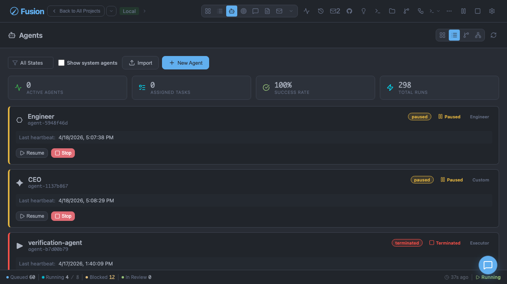

# Agents

[← Docs index](./README.md)

Fusion uses multiple agent roles for triage, execution, review, and merge workflows.

## Agents View (Dashboard)

The agents surface provides:

- Agent list and status
- Detail/config panels
- Runtime metrics
- Run history
- Task assignment context



## Built-In Agent Prompt Templates

Fusion includes built-in templates for role prompts:

- `default-executor`
- `default-triage`
- `default-reviewer`
- `default-merger`
- `senior-engineer`
- `strict-reviewer`
- `concise-triage`

These can be assigned per role using `agentPrompts.roleAssignments`.

## Per-Agent Configuration

Agents can be configured with:

- Custom instructions
- Heartbeat interval/timeout limits
- Max concurrent heartbeat runs

Heartbeat values are validated and minimum-clamped.

## New Agent Presets (Dashboard UI)

The New Agent dialog in the dashboard provides quick-start presets for common agent roles. Each preset includes:

- **Name and icon** — Display identification
- **Professional title** — Descriptive role title
- **Soul** — Personality and operating principles defining how the agent thinks and communicates
- **Instructions** — Actionable behavioral guidelines

### Preset Library Location

Preset definitions live in `packages/dashboard/app/components/agent-presets/`:

```
agent-presets/
├── index.ts              # Exports AGENT_PRESETS and helper functions
├── ceo/soul.md          # Chief Executive Officer soul
├── cto/soul.md          # Chief Technology Officer soul
├── cmo/soul.md          # Chief Marketing Officer soul
├── cfo/soul.md          # Chief Financial Officer soul
├── engineer/soul.md     # Software Engineer soul
├── backend-engineer/soul.md
├── frontend-engineer/soul.md
├── fullstack-engineer/soul.md
├── qa-engineer/soul.md
├── devops-engineer/soul.md
├── ci-engineer/soul.md
├── security-engineer/soul.md
├── data-engineer/soul.md
├── ml-engineer/soul.md
├── product-manager/soul.md
├── designer/soul.md
├── marketing-manager/soul.md
├── technical-writer/soul.md
├── triage/soul.md
└── reviewer/soul.md
```

### Soul File Format

Each `soul.md` file is a Markdown document containing:

```markdown
# Soul: [Role Name]

[First-person identity statement]

## Operating Principles

[Bullet points describing key behaviors]

## Communication Style

[How the agent communicates]
```

Soul content should be:

- **First-person** — Written from the agent's perspective ("I am...")
- **Role-specific** — Defines the unique character of this role
- **Actionable** — Describes concrete behaviors, not abstract qualities
- **Paperclip-inspired** — Clear ownership, decision discipline, communication standards

### Adding or Modifying Presets

1. Create or edit the `soul.md` file in the appropriate directory
2. Update `index.ts` if adding a new preset (export the imported soul and add to `AGENT_PRESETS` array)
3. Run tests to verify: `pnpm --filter @fusion/dashboard exec vitest run app/components/__tests__/agent-presets.test.ts`

### Preset vs Engine Templates

**Dashboard presets** are a UI-only concept that populates the New Agent dialog fields (name, icon, role, soul, instructionsText). They don't map to engine types.

**Engine role prompts** (in `agentPrompts` settings) define the actual agent behavior when executing tasks. These are separate from dashboard presets and live in project settings.

This separation means:
- Presets provide starting point personality and instructions for new agents
- Engine templates control actual task execution behavior
- An agent created from a preset can have its engine role prompt customized independently

## Configurable Agent Prompts (`agentPrompts`)

`agentPrompts` project setting supports:

- `templates[]`: custom prompt templates by role
- `roleAssignments`: map role → template ID

When no assignment is configured, Fusion falls back to built-in defaults.

## Inter-Agent Messaging

Messaging is available in dashboard mailbox UI and CLI.

```bash
fn message inbox
fn message outbox
fn message send AGENT-001 "Please prioritize FN-420"
fn message read MSG-123
fn message delete MSG-123
fn agent mailbox AGENT-001
```

## Agent Spawning

Executor sessions can spawn child agents through `spawn_agent`.

Behavior:

- Child agents run in separate worktrees
- Parent/child relationship is tracked
- Limits enforced:
  - `maxSpawnedAgentsPerParent` (default 5)
  - `maxSpawnedAgentsGlobal` (default 20)
- Child sessions terminate when parent task ends

## Heartbeat Monitoring and Trigger Scheduling

Fusion’s `HeartbeatTriggerScheduler` supports three trigger types:

- `timer` — periodic wake based on heartbeat interval
- `assignment` — wake when task is assigned to agent
- `on_demand` — manual run trigger (`POST /api/agents/:id/runs`)

All triggers respect per-agent `maxConcurrentRuns` and produce structured wake context metadata.

## Related Docs

- [Workflow Steps](./workflow-steps.md)
- [Settings Reference](./settings-reference.md)
- [Architecture](./architecture.md)
