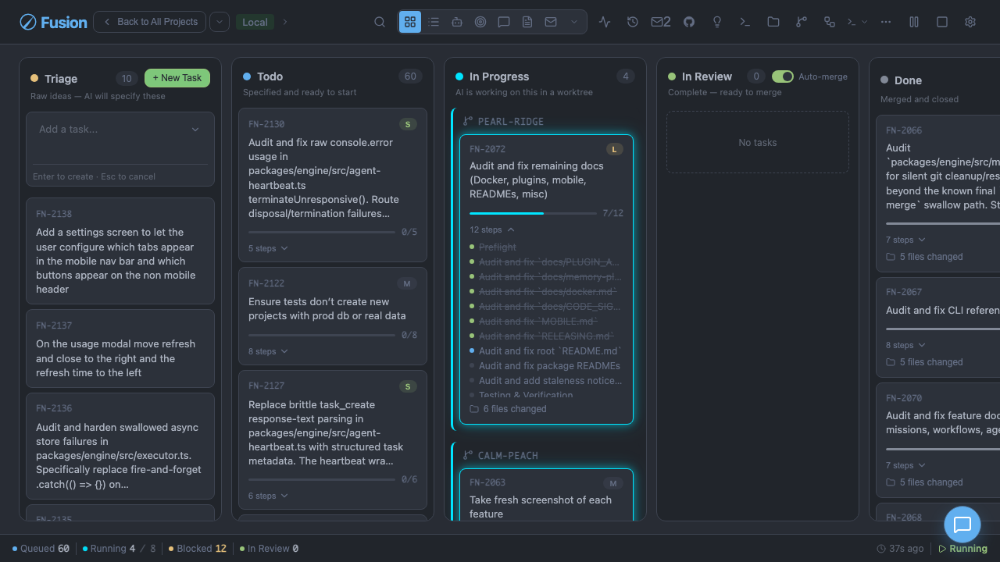

# Getting Started

[← Docs index](./README.md)

This guide gets Fusion running, explains first-run setup, and walks through your first task from creation to completion.

## Prerequisites

Fusion uses the `pi` agent runtime for AI sessions.

1. Install pi:

```bash
npm i -g @mariozechner/pi-coding-agent
```

2. Authenticate pi (for example with `/login`) or configure provider API keys.

```bash
pi
```

### Optional: Install the Paperclip Runtime Plugin

The Paperclip Runtime Plugin (`fusion-plugin-paperclip-runtime`) provides an alternative runtime adapter for AI agents. It wraps the same `pi` backend but registers as a discoverable plugin runtime, enabling runtime selection at the agent level.

To install the plugin:

```bash
fn plugin install ./plugins/fusion-plugin-paperclip-runtime
```

After installation, select the Paperclip runtime for an agent by setting `runtimeHint` in the agent's `runtimeConfig`:

```json
{
  "name": "Paperclip Executor",
  "role": "executor",
  "runtimeConfig": {
    "runtimeHint": "paperclip"
  }
}
```

For details on runtime selection, fallback behavior, and constraints, see the [Paperclip Runtime Plugin documentation](../plugins/fusion-plugin-paperclip-runtime/README.md).

### Optional: Install the Hermes Runtime Plugin (Experimental)

The Hermes Runtime Plugin (`fusion-plugin-hermes-runtime`) registers an experimental runtime hint (`"hermes"`) so agents can explicitly target Hermes in runtime selection.

Install the plugin:

```bash
fn plugin install ./plugins/fusion-plugin-hermes-runtime
```

Configure an agent to use Hermes:

```json
{
  "name": "Hermes Executor",
  "role": "executor",
  "runtimeConfig": {
    "runtimeHint": "hermes"
  }
}
```

> ℹ️ Hermes is experimental. Runtime registration, selection, and execution are supported through the Hermes plugin runtime adapter.

For Hermes-specific details, see the [Hermes Runtime Plugin documentation](../plugins/fusion-plugin-hermes-runtime/README.md).

### Optional: Install the OpenClaw Runtime Plugin (Experimental)

The OpenClaw Runtime Plugin (`fusion-plugin-openclaw-runtime`) registers an experimental runtime hint (`"openclaw"`) so agents can explicitly target OpenClaw in runtime selection.

Install the plugin:

```bash
fn plugin install ./plugins/fusion-plugin-openclaw-runtime
```

Configure an agent to use OpenClaw:

```json
{
  "name": "OpenClaw Executor",
  "role": "executor",
  "runtimeConfig": {
    "runtimeHint": "openclaw"
  }
}
```

> ℹ️ OpenClaw is experimental. Runtime registration, selection, and execution are supported through the OpenClaw plugin runtime adapter.

For OpenClaw-specific details, see the [OpenClaw Runtime Plugin documentation](../plugins/fusion-plugin-openclaw-runtime/README.md).

## Install Fusion

Install the published CLI package globally:

```bash
npm i -g @runfusion/fusion
```

Then verify install:

```bash
fn --help
```

## Initialize a Project

In each repository you want Fusion to manage, run:

```bash
fn init
```

On fresh init, Fusion also installs its bundled `fusion` skill into supported agent homes (`~/.claude/skills/fusion`, `~/.codex/skills/fusion`, `~/.gemini/skills/fusion`) when those targets are missing. Existing installs are left untouched.

## First Run and Onboarding

Start the dashboard:

```bash
fn dashboard
```

On first launch, Fusion automatically opens the **onboarding wizard**. It guides you through three steps:

1. **AI Setup** — Start with a simplified quick-start list of recommended providers (`anthropic`, `openai`, `google`, `gemini`, `ollama`), plus any providers you already connected. You only need one provider to get started. Additional providers and detailed setup guidance live under the **Advanced provider settings** disclosure. Authenticate via OAuth login (for supported providers like OpenAI Codex) or enter an API key directly.

2. **GitHub (Optional)** — Connect GitHub to import issues and manage pull requests. This step is optional — you can continue without GitHub.

3. **First Task** — Get started by creating your first task or importing from GitHub. If no project is currently selected, onboarding first prompts you to register/select a project directory before task actions are enabled.

**The onboarding wizard is dismissible and non-blocking.** If you skip setup, you can complete it later — and you can always update your AI provider authentication anytime via **Settings → Authentication** in the dashboard:
- Click **Skip for now** to dismiss the wizard — the dashboard remains fully usable
- After dismissing, a **Continue Setup** banner appears at the top of the dashboard, letting you resume from where you left off
- Re-open onboarding anytime from **Settings → Authentication → Reopen onboarding guide**

When reopening onboarding, the wizard pre-populates your previously saved AI provider and default model, so you can quickly review or update your setup.

Onboarding completion is tracked by `modelOnboardingComplete` in global settings.

## Start the Dashboard

Common startup options:

```bash
fn dashboard                       # default port 4040
fn dashboard --port 5050           # custom port
fn dashboard -p 5050               # short form for --port
fn dashboard --interactive         # choose port interactively
fn dashboard --paused              # start with automation paused
fn dashboard --dev                 # run UI only (no engine)
```

On startup, Fusion prints a click-to-open URL that includes a bearer token:

```
→ http://localhost:4040
Token:   fn_8f3a...
Open:    http://localhost:4040/?token=fn_8f3a...
```

Click the **Open** link. Your browser captures the token into `localStorage`,
strips it from the visible URL, and reuses it automatically on later loads.
See [CLI reference → fn dashboard → Authentication](./cli-reference.md#fn-dashboard)
for details, including token precedence (CLI/env overrides over the persisted
`~/.fusion` token) and how to disable auth with `--no-auth` for strictly-local setups.

Other launch modes:

```bash
fn dashboard --host 0.0.0.0            # expose on LAN (auth stays on by default)
fn serve --port 5050 --host 0.0.0.0    # headless node (API + engine, no web UI)
fn daemon --port 5050                  # daemon mode with token auth support
fn desktop                             # launch Electron desktop app
```

## Create Your First Task

You can create tasks from the board or CLI.

### Option A: Quick Entry (Board)

1. Type a short request in the quick entry input.
2. Press Enter.
3. Task appears in **Triage** and the triage agent generates `PROMPT.md`.

### Option B: Plan Mode (Board)

Use the 💡 button to open AI planning mode:

- Fusion asks clarifying questions
- Produces a structured summary
- Lets you create one task or break into multiple dependency-linked tasks

### Option C: Subtask Breakdown (Board)

Use the 🌳 button to:

- Generate 2–5 subtasks
- Reorder by drag-and-drop
- Add dependency links before creating tasks

### Option D: Expanded Controls (Board)

Expand the quick entry panel (▼) to access additional controls:

- **Refine** (✨) — Improve the description with AI
- **Deps** (🔗) — Link existing tasks as dependencies
- **Attach** — Add image attachments
- **Models** (🧠) — Set per-task model overrides
- **Agent** — Assign an agent to the task
- **Save** — Create the task manually

### Option E: CLI

```bash
fn task create "Fix flaky login test"
fn task plan "Implement role-based access control"
```

## Understand the Task Lifecycle

Fusion uses six columns:

1. **Triage** — raw idea; AI writes spec
2. **Todo** — specified and queued
3. **In Progress** — executor implements in a dedicated worktree
4. **In Review** — implementation complete, awaiting merge/finalization
5. **Done** — merged and complete
6. **Archived** — retained for history, optionally cleaned up from filesystem

## Daily CLI Commands

```bash
fn task list
fn task show FN-001
fn task logs FN-001 --follow --limit 50
fn task steer FN-001 "Prefer existing utility functions"
fn task pause FN-001
fn task unpause FN-001
```

## Dashboard Orientation (Annotated)



Suggested way to read the screen:

- **Top bar:** global actions (settings, activity, mission/agent tools)
- **Columns:** task lifecycle stages
- **Task cards:** status, metadata, PR/issue badges
- **Quick entry:** fastest way to create a new task

Next: [Architecture](./architecture.md) for internals, or [Task Management](./task-management.md) for deeper task workflows.
