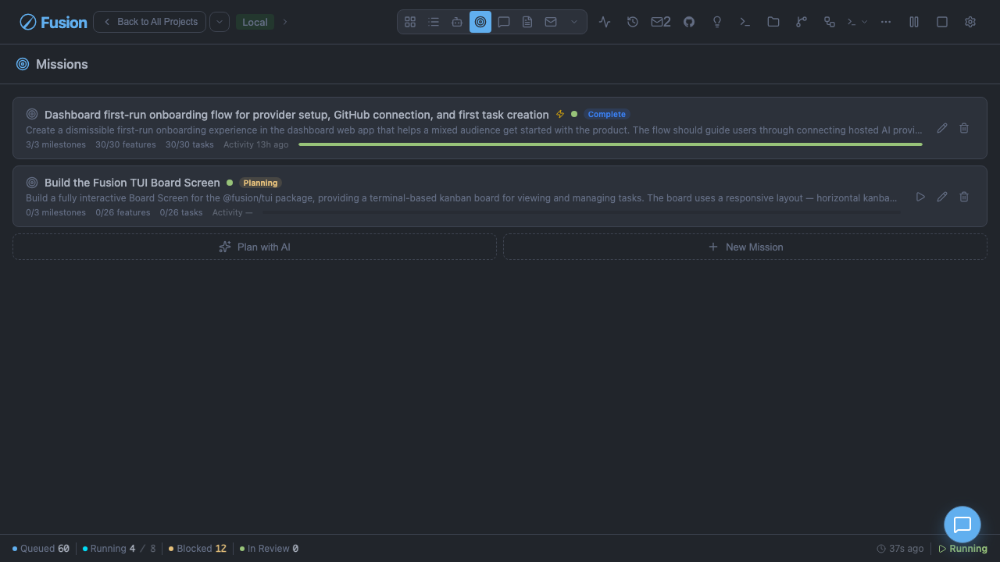

# Missions

[← Docs index](./README.md)

Missions provide structured planning across multiple related tasks.

> Roadmaps are a separate lightweight planning model (`Roadmap → RoadmapMilestone → RoadmapFeature`) used for standalone planning. Missions remain the richer execution-oriented hierarchy when you need slice activation, autopilot, and feature-to-task delivery tracking.

## Mission Hierarchy

Fusion models delivery as:

**Mission → Milestone → Slice → Feature → Task**

Example:

```text
Mission: Improve Reliability
  Milestone: Stabilize execution pipeline
    Slice: Retry and recovery hardening
      Feature: Stuck task recovery improvements
        Task: FN-210
        Task: FN-214
```

## Creating Missions

### Dashboard

Use the Mission Manager UI to create missions and build hierarchy interactively.

### CLI

```bash
fn mission create "Reliability initiative" "Reduce execution failures and improve recovery"
fn mission list
fn mission show mission_123
fn mission activate-slice slice_456
fn mission delete mission_123 --force
```

## Mission Interview and Planning Workflow

The dashboard supports mission planning workflows where you can:

- Define mission outcomes
- Break work into milestones/slices/features
- Associate features to executable tasks
- Track progress at each layer

### Auto-Generated Assertions

When missions are created through the interview planning workflow, Fusion automatically generates contract assertions for each feature:

- **Assertion text source priority**: `acceptanceCriteria` → `feature.description` → fallback text (`"Verify implementation of: {feature.title}"`)
- **Assertions are linked to features**: Each auto-generated assertion is automatically linked to its feature, enabling mission validation rollup and enriched triage context
- **Verification fields**: Milestone and slice verification criteria from the interview are stored in dedicated `verification` fields rather than concatenated into descriptions
- **Partial plans handled**: Auto-generation is robust to partial plans (missing slices/features or empty criteria) without throwing errors

## Slice Activation and Progress

Slices represent staged execution windows.

- Pending slices remain inactive
- Active slices are currently allowed to progress
- Completion rolls up through feature → slice → milestone → mission

Manual activation is available through `fn mission activate-slice <slice-id>`.

## Mission Autopilot

When `autopilotEnabled` is on, Fusion can watch completion events and progress missions automatically.

State machine:

- `inactive`
- `watching`
- `activating`
- `completing`

Typical flow:

1. Mission is watched
2. Task completion updates feature status
3. If a slice is complete, autopilot activates next pending slice
4. When milestones are all complete, mission transitions to complete

## `autopilotEnabled` vs `autoAdvance`

- **`autopilotEnabled`**: primary control for autopilot behavior — enables background monitoring, orchestration, and automatic slice activation when a slice completes. Also triggers auto-triage (converting features to tasks) when a slice is activated.
- **`autoAdvance`**: legacy fallback for backward compatibility with existing mission data. Kept for compatibility — new missions should use `autopilotEnabled`.

**Auto-triage behavior:**

- `autopilotEnabled=true` → features in activated slices are automatically triaged (converted to tasks)
- `autopilotEnabled=false`, `autoAdvance=true` → features are triaged (legacy compat)
- `autopilotEnabled=false`, `autoAdvance=false` → manual slice activation only

**Slice progression (on slice completion):**

- `autopilotEnabled=true` → next pending slice is automatically activated
- `autopilotEnabled=false`, `autoAdvance=true` → next pending slice is activated (legacy compat)
- `autopilotEnabled=false`, `autoAdvance=false` → manual activation required

**Dashboard UI:** The Mission Manager shows `autopilotEnabled` as the primary control. When enabling autopilot on an already-active mission, the system automatically checks whether recovery is needed (no active slice or completed active slice) and progresses accordingly.

## Autopilot API Endpoints

| Endpoint | Purpose |
|---|---|
| `GET /api/missions/:missionId/autopilot` | Get autopilot status for mission |
| `PATCH /api/missions/:missionId/autopilot` | Enable/disable autopilot (`{ enabled: boolean }`) |
| `POST /api/missions/:missionId/autopilot/start` | Start watching manually |
| `POST /api/missions/:missionId/autopilot/stop` | Stop watching manually |

## Screenshot



See also: [Multi-Project](./multi-project.md) and [Task Management](./task-management.md).
